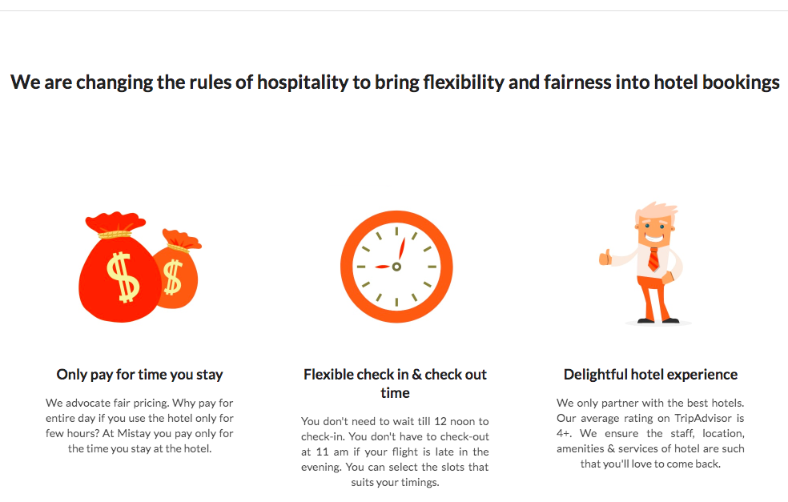
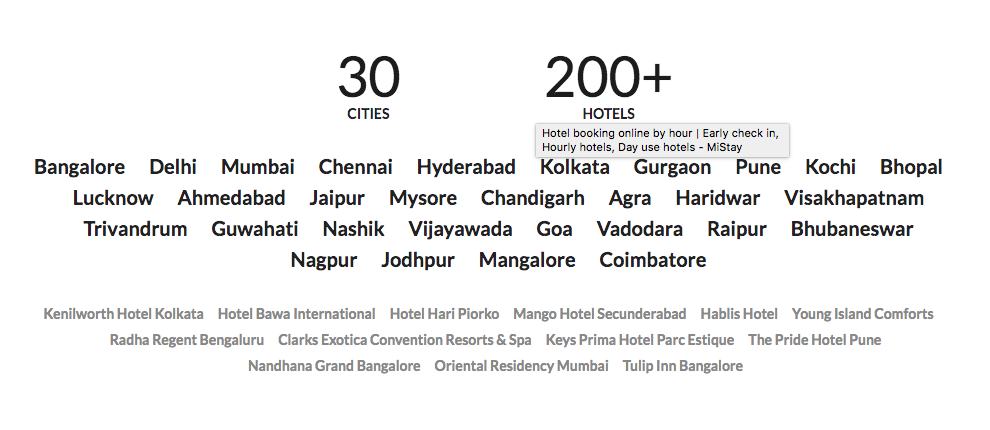

For this activity, we will be attempting to rebuild a website that has been built with Semantic UI.

Take a look at the following portion of the website.  

1. Build our first section

First we want to build this.

A. Map out the page

Notice the top divider gray bar at the top.  Then the beneath is content largely made up of rows and columns.  First divide the page up into rows and columns that you think make up the portion of the site. 

B. Build out the first portion

Then attempt to construct the site with the Semantic UI library.  For the pictures, you can use different images that you get from the "icons" library.

2. Now try the second portion 

A. Map out the page

Ok, so think about how the second section is mapped out.  It is a little more tricky.  What type of element tag should be used for the collections of cities and then the collection of gray hotels below.  (You can type in your own cities.)  Check out a styling in semantic called horizontal list.  

